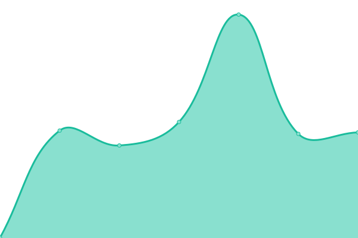

# [📈 Live Status](https://kunik1o.github.io/heartbeat.oau): <!--live status--> **🟧 Partial outage**

This repository contains the open-source uptime monitor and status page for [K[uni]kl0](https://kunik1o.github.io/heartbeat.oau), powered by [Upptime](https://github.com/upptime/upptime).

With [Upptime](https://upptime.js.org), you can get your own unlimited and free uptime monitor and status page, powered entirely by a GitHub repository. We use [Issues](https://github.com/kunik1o/heartbeat.oau/issues) as incident reports, [Actions](https://github.com/kunik1o/heartbeat.oau/actions) as uptime monitors, and [Pages](https://kunik1o.github.io/heartbeat.oau) for the status page.

<!--start: status pages-->
<!-- This summary is generated by Upptime (https://github.com/upptime/upptime) -->
<!-- Do not edit this manually, your changes will be overwritten -->
<!-- prettier-ignore -->
| URL | Status | History | Response Time | Uptime |
| --- | ------ | ------- | ------------- | ------ |
|  [One Among US Main](https://www.one-among.us/) | 🟩 Up | [one-among-us-main.yml](https://github.com/kunik1o/heartbeat.oau/commits/HEAD/history/one-among-us-main.yml) | 

 126ms
     
 | 

<a href="https://kunik1o.github.io/heartbeat.oau/history/one-among-us-main">100.00%</a>
    

|  [One Among US CA](https://oneamongus.ca/) | 🟩 Up | [one-among-us-ca.yml](https://github.com/kunik1o/heartbeat.oau/commits/HEAD/history/one-among-us-ca.yml) | 

 167ms
     
 | 

<a href="https://kunik1o.github.io/heartbeat.oau/history/one-among-us-ca">99.83%</a>
    

|  [One Among US Data](https://data.one-among.us/) | 🟩 Up | [one-among-us-data.yml](https://github.com/kunik1o/heartbeat.oau/commits/HEAD/history/one-among-us-data.yml) | 

 129ms
     
 | 

<a href="https://kunik1o.github.io/heartbeat.oau/history/one-among-us-data">100.00%</a>
    

|  [One Among US Backend](https://backend.one-among.us/) | 🟥 Down | [one-among-us-backend.yml](https://github.com/kunik1o/heartbeat.oau/commits/HEAD/history/one-among-us-backend.yml) | 

 354ms
     
 | 

<a href="https://kunik1o.github.io/heartbeat.oau/history/one-among-us-backend">0.00%</a>
    

|  [Negatice Control](https://thissitedoesnotexist.koj.co/) | 🟥 Down | [negatice-control.yml](https://github.com/kunik1o/heartbeat.oau/commits/HEAD/history/negatice-control.yml) | 

 0ms
     
 | 

<a href="https://kunik1o.github.io/heartbeat.oau/history/negatice-control">0.00%</a>
    

<!--end: status pages-->

[**Visit our status website →**](https://kunik1o.github.io/heartbeat.oau)

## 📄 License

- Powered by: [Upptime](https://github.com/upptime/upptime)
- Code: [MIT](./LICENSE) © [K[uni]kl0](https://kunik1o.github.io/heartbeat.oau)
- Data in the `./history` directory: [Open Database License](https://opendatacommons.org/licenses/odbl/1-0/)
