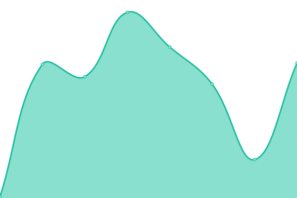

# [📈 Live Status](https://kunik1o.github.io/heartbeat.oau): <!--live status--> **🟧 Partial outage**

This repository contains the open-source uptime monitor and status page for [K[uni]kl0](https://kunik1o.github.io/heartbeat.oau), powered by [Upptime](https://github.com/upptime/upptime).

With [Upptime](https://upptime.js.org), you can get your own unlimited and free uptime monitor and status page, powered entirely by a GitHub repository. We use [Issues](https://github.com/kunik1o/heartbeat.oau/issues) as incident reports, [Actions](https://github.com/kunik1o/heartbeat.oau/actions) as uptime monitors, and [Pages](https://kunik1o.github.io/heartbeat.oau) for the status page.

<!--start: status pages-->
<!-- This summary is generated by Upptime (https://github.com/upptime/upptime) -->
<!-- Do not edit this manually, your changes will be overwritten -->
<!-- prettier-ignore -->
| URL | Status | History | Response Time | Uptime |
| --- | ------ | ------- | ------------- | ------ |
|  [main.ping](https://www.one-among.us/) | 🟥 Down | [main-ping.yml](https://github.com/artefaritaKuniklo/heartbeat.oau/commits/HEAD/history/main-ping.yml) | 

 0ms
     
 | 

<a href="https://artefaritaKuniklo.github.io/heartbeat.oau/history/main-ping">15.53%</a>
    

|  [ca.ping](https://oneamongus.ca/) | 🟥 Down | [ca-ping.yml](https://github.com/artefaritaKuniklo/heartbeat.oau/commits/HEAD/history/ca-ping.yml) | 

 0ms
     
 | 

<a href="https://artefaritaKuniklo.github.io/heartbeat.oau/history/ca-ping">0.96%</a>
    

|  [data.ping](https://data.one-among.us/) | 🟥 Down | [data-ping.yml](https://github.com/artefaritaKuniklo/heartbeat.oau/commits/HEAD/history/data-ping.yml) | 

 0ms
     
 | 

<a href="https://artefaritaKuniklo.github.io/heartbeat.oau/history/data-ping">4.70%</a>
    

|  [be.ping](https://backend.one-among.us/) | 🟥 Down | [be-ping.yml](https://github.com/artefaritaKuniklo/heartbeat.oau/commits/HEAD/history/be-ping.yml) | 

 0ms
     
 | 

<a href="https://artefaritaKuniklo.github.io/heartbeat.oau/history/be-ping">9.88%</a>
    

|  [data.page](https://data.one-among.us/people/noname/page.js) | 🟩 Up | [data-page.yml](https://github.com/artefaritaKuniklo/heartbeat.oau/commits/HEAD/history/data-page.yml) | 

 167ms
     
 | 

<a href="https://artefaritaKuniklo.github.io/heartbeat.oau/history/data-page">100.00%</a>
    

|  [be.flower](https://backend.one-among.us/flowers/get?id=noname) | 🟩 Up | [be-flower.yml](https://github.com/artefaritaKuniklo/heartbeat.oau/commits/HEAD/history/be-flower.yml) | 

 375ms
     
 | 

<a href="https://artefaritaKuniklo.github.io/heartbeat.oau/history/be-flower">100.00%</a>
    

|  [nc.ping](https://thissitedoesnotexist.koj.co/) | 🟥 Down | [nc-ping.yml](https://github.com/artefaritaKuniklo/heartbeat.oau/commits/HEAD/history/nc-ping.yml) | 

 0ms
     
 | 

<a href="https://artefaritaKuniklo.github.io/heartbeat.oau/history/nc-ping">30.02%</a>
    

<!--end: status pages-->

[**Visit our status website →**](https://kunik1o.github.io/heartbeat.oau)

## 📄 License

- Powered by: [Upptime](https://github.com/upptime/upptime)
- Code: [MIT](./LICENSE) © [K[uni]kl0](https://kunik1o.github.io/heartbeat.oau)
- Data in the `./history` directory: [Open Database License](https://opendatacommons.org/licenses/odbl/1-0/)
